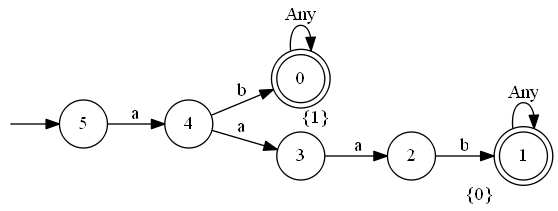

# pyautomatatf

## Automata with typed final states for regular languages

In scenarios such as intrusion detection, anti virus and data loss prevention, the need arises to match some stream of data for multiple patterns (often expressed as regexes). All these scenarios require fast pattern matching, and deterministic automata have a successful history in this domain (e.g. hyperscan.io project). The theory of regular languages provides all the tools to construct an automaton that matches for several patterns simultaneously at reasonable speed. But a successful match should also refer to the pattern(s) that actually matched.

The presented library refines the well-known automata classes from regular languages (dfa, nfa) by types for final states. A type could be, e.g. a pattern reference. Operations such as minimization or product automaton are also refined to properly deal with type information. Therefore, it is possible to merge a set of regexes into a single dfa with typed final states. Maybe, some time in the future, I will write a paper about this.

An application for this library is lexical datatype inference from a set of strings (see https://arxiv.org/abs/1603.07924).

The pyautomatatf library was designed for educational purposes and all important operations on automata and a regex parser has been implemented. Be aware: determinization of regexes suffers from state explosion, so, issues should be expected.

Requirements: python3, pyparsing, graphviz ("dot" command has to be available).